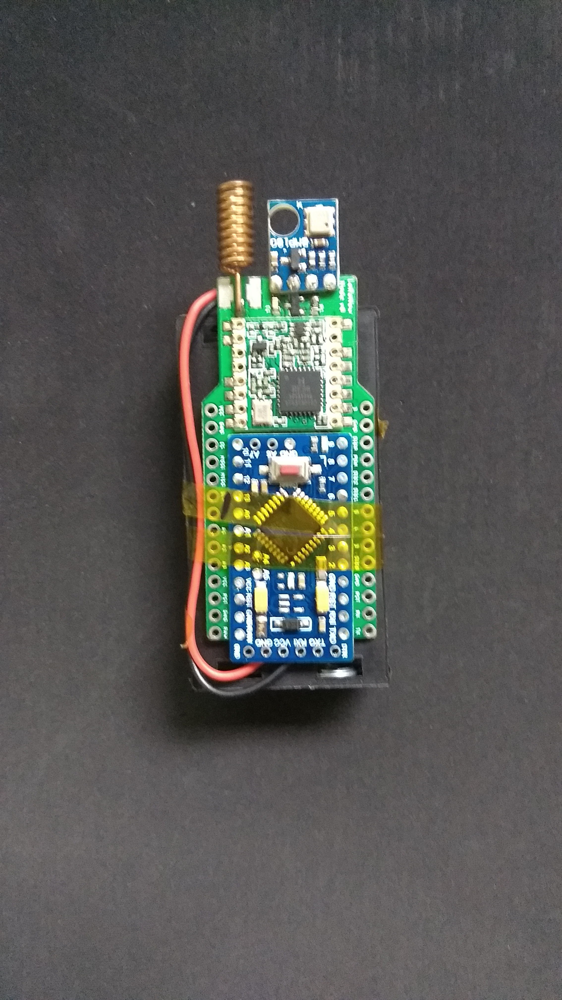
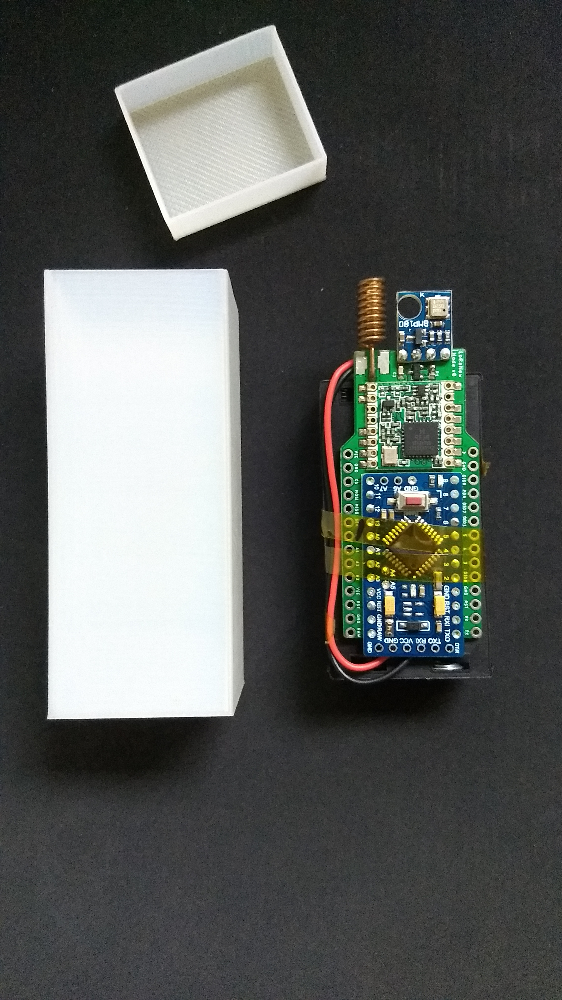
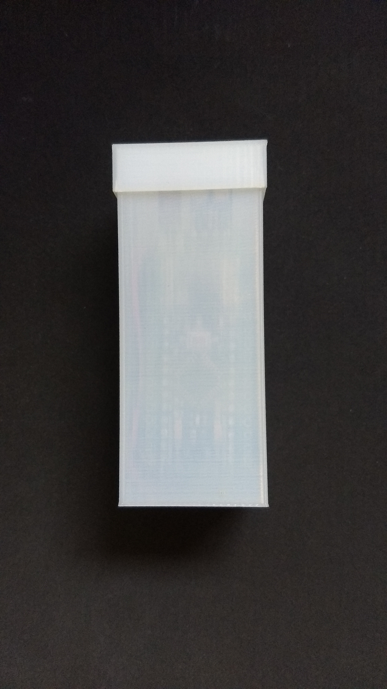
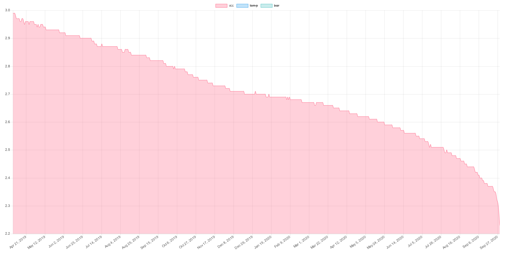

# LoRaNow 18 Months

This project is a long run using the [LoRaNow Board V0](https://github.com/ricaun/LoRaNow-board) and [The Things Network](https://www.thethingsnetwork.org/) to check how long a node can stay on only with two AA battery.

The Node starts in April of 2019 and dies in September of 2020, 18 months in total.

The Node sleeps and send data using LoRaWAN each ~10 minutes.

## LoRaNow Board - V0

<a href="https://github.com/ricaun/LoRaNow-board">



</a>

## Arduino Code

[The Arduino code is available here.](arduino)

## Data

The data uses a JSON format and has 3 files with the data group by days, hours, and minutes.

```
[
  {
    "date": "2020-09-29 12:00:00",
    "gateway_rssi": "-45",
    "counter": "71086",
    "counterMin": "70987",
    "vccMin": "2.15",
    "vcc": "2.23",
    "vccMax": "2.26",
    "tempMin": "22.00",
    "temp": "22.96",
    "tempMax": "24.10",
    "barMin": "1010.40",
    "bar": "1012.02",
    "barMax": "1014.20"
  },
  ...
]
```

<a href="data">

</a>


* [data-days.json](data/data-days.json)
* [data-hours.json](data/data-hours.json)
* [data-minutes.json](data/data-minutes.json)

## License

This library is [licensed](LICENSE) under the [MIT Licence](https://en.wikipedia.org/wiki/MIT_License).

----

See news and other projects on my [LoRaNow Blog](http://loranow.com)
